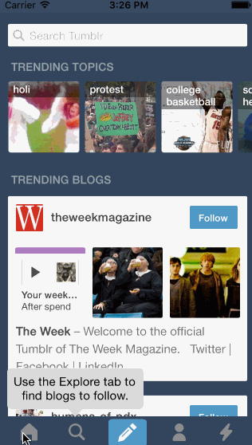

# codepath-assignment4-tumblr

This is an iOS tumblr application for CodePath submission. 

Time spent: 15 hours spent in total

Completed user stories:

* [x] Setup
    - [x] Create a new project (disable Auto Layout). 
    - [x] Add the image assets above.
    - [x] Configure the app icon and splash screen. Guide
* [x] Create initial TabBarViewController view
    - [x] Add a view that is 44 pts tall for the tab bar and choose the color.
    - [x] Add 5 buttons for Home, Search, Compose, Account, and Trending. Be sure to configure them as custom buttons with images for the default and selected state.
    - [x] Add a view for the content above the tab bar. Create an outlet for it called contentView.
* [x] Create initial HomeViewController view
    - [x] Add 3 image views for the background, text, and spinner.
    - [x] Create the HomeViewController class.
* [x] Create initial SearchViewController
    - [x] Add image view for the search feed.
    - [x] Create the SearchViewController class.
* [x] Create initial ComposeViewController view
    - [x] Set the background color of the view to be a blue with some transparency.
    - [x] Add 6 custom buttons with the compose button images.
    - [x] Add a Nevermind button at the bottom of the view.
    - [x] Create the ComposeViewController class.

* [x] Create initial AccountViewController view
    - [x] Add image view for the account view.
    - [x] Create the AccountViewController class.

* [x] Create initial TrendingViewController view
    - [x] Add scroll view with embedded image view.
    - [x] Create the TrendingViewController class.
    - [x] Create outlets for the scroll view and image view and set the content size of the scroll view.

* [x] Implement TabBarViewController behavior
    - [x] Connect the tab bar buttons to a shared action function. In that function, add the view of the selected view controller to the contentView.
    - [x] It's useful to track what the currently selected button and view controller is in a property, so you can unselect the button or remove the view controller's view when another button is selected.
    - [x] Guide: Creating a Custom Tab Bar
* [x] Compose Buttons Transition
    - [x] The compose button should modally segue to the ComposeViewController.
    - [x] Compose Button Animations
    - [x] Add a viewWillAppear method to the ComposeViewController. Within theviewWillAppear method, set the initial positions of the compose buttons to below the screen.
    - [x] Add a viewDidAppear method. Within the viewDidAppear method, schedule the animations of the compose buttons.
    - [x] Tapping the "Nevermind" button should dismiss the ComposeViewController. Dismissing Modal Transitions
    - [ ] Optional: Create a Custom Modal Transition so the Compose screen fades in. Creating a Custom Modal Transition
* [x] Login
    - [x] Display the login form in a modal segue.
    - [ ] Optional: Create a Custom Transition to fade in the login screen. Creating a Custom Modal Transition

* [x] Bobbing Discover Bubble
    - [ ] Optional: Add an image view to the custom tab bar controller. When the appropriate button is selected, hide the bubble. Otherwise, show it. Animation Options
* [x] Loading
    - [x] Add a viewWillAppear method to the searchViewController. Within theviewWillAppear method, hide the background image feed and show the custom loading indicator.
    - [x] Add a viewDidAppear method to the searchViewController. Within theviewDidAppear method, add a delay method. In the completion block of the delay, hide the custom loading indicator and show the background image feed. Use the delay method
    - [ ] Optional: Show the custom loading indicator by playing the sequence of pngs. Animating a Sequence of Images.
 
Notes:

Watched the video tutorial and some other how to’s to dos to make the application.

Walkthrough of all user stories:

GIF created with [LiceCap](http://www.cockos.com/licecap/).